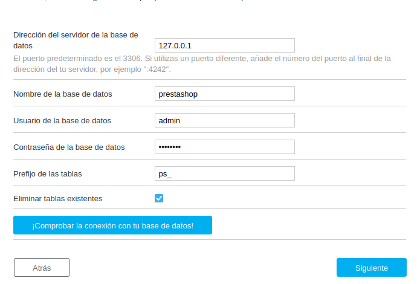

### Creación del servidor de Prestashop+mysql en docker-compose.
## Haciendo el Docker-compose.yaml según los DevDocs de prestashop.
Una vez hayamos preparado el yaml del docker compose y lo hayamos puesto a arrancar. Iremos al localhost:8080 y haremos los pasos a requerir según su installer.
 
He acá unas fotos de ejemplo sobre los datos que pide.

 

# Installer
Siguiendo los requerimientos del installer. Puede que pase un quebradero de cabeza en el último paso antes de instalar el prestashop y es el siguiente.

 
A la hora de poner la IP del contenedor mysql que hay junto con el de prestashop,haz docker-inspect si es necesario, o bien en la red de prestashop_networks que tiene o bien en la del contenedor mysql.A la hora de poner el usuario de la base de datos <b>déjalo en root, no tomará otro para conectar con el container mysql.</b>
 
Una vez hayas comprobado que el installer fue capaz de conectar con mysql, habrás logrado llegar al útlimo paso para instalar el prestashop. Felicidades!
